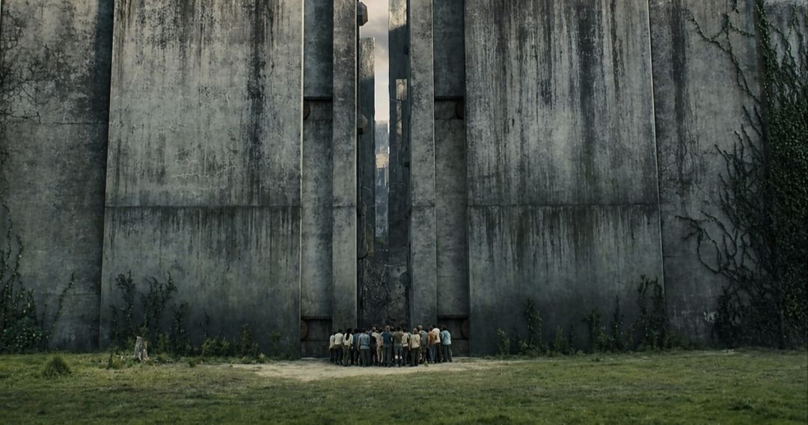
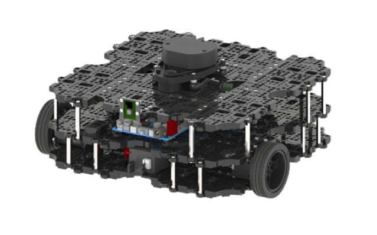
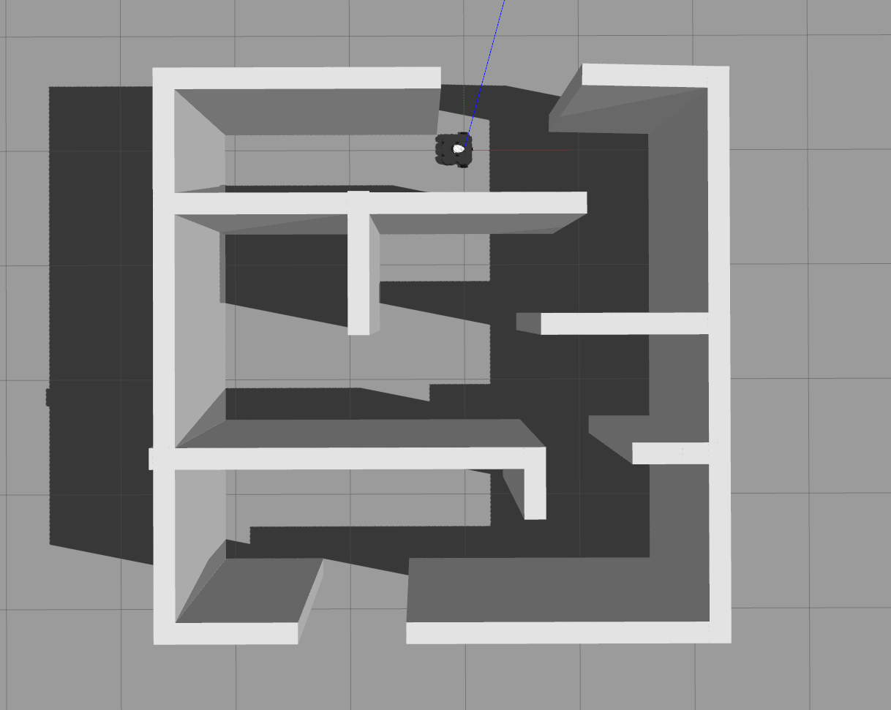

[TOC]
# 建图与导航
> - 题目背景  
>
你穿越到了电影**移动迷宫**的世界。  

你站在**迷宫的入口**处，迷宫内**危机四伏**。但是又只有**穿过这个迷宫**你才能成功的逃出去。  
好在你是一名优秀的**机器人工程师！**  
你手里有一台简易的**机器人小车**，请你利用它来进行**建图和导航**来帮助你逃出去。  
> - 任务配置
>
基于**ubuntu 22.04 LTS**和**ros2 humble**来完成你的任务。  
基于**slam_toolbox**进行简易建图以及**navgation2框架**来完成导航。  
本题目基于**turtlebot3**的开源urdf进行构建。项目地址为:  
[https://github.com/ROBOTIS-GIT/turtlebot3](https://github.com/ROBOTIS-GIT/turtlebot3)  
使用的型号为**waffle_pi**  
  
提供给你的**文件**:  
一个类型为**ament_cmake**的名称为**sim_robot**的功能包。功能包里已做好了**gazebo**里的相关**雷达，相机**仿真，以及**惯性，质量**等定义。已经配置好了**rviz**默认文件。  
在**world**里准备好了**maze**。(你需要进行建图的文件。)  
  
机器人所在的位置为**起点**,另一位置为**终点**。  
> - 你需要完成的工作
>
编写**ament_cmake**类型的功能包，完成**简易建图**，并启用**路点导航**，从起点到达终点。  
> - 提交方式
>
**fork**后建立你自己的分支，提交**pr**。  
需要提交你的完整代码(git add .)  
附上运行视频。  

提供**参考视频**。  
```console
# 可参考的目录结构

src
├── Navi_bot
│   ├── CMakeLists.txt
│   ├── config
│   │   └── nav2_params.yaml
│   ├── launch
│   │   ├── nav2.py
│   │   └── slam_toolbox.py
│   ├── LICENSE
│   ├── maps
│   │   ├── maze.pgm
│   │   └── maze.yaml
│   └── package.xml
└── sim_robot
    ├── CMakeLists.txt
    ├── config
    │   └── rviz2
    │       └── default.rviz
    ├── launch
    │   ├── bot_pub.py
    │   ├── gazebo.launch.py
    │   └── launch.and.py
    ├── LICENSE
    ├── meshes
    │   ├── bases
    │   │   └── waffle_pi_base.stl
    │   ├── sensors
    │   │   ├── astra.dae
    │   │   ├── astra.jpg
    │   │   ├── lds.stl
    │   │   ├── r200.dae
    │   │   └── r200.jpg
    │   └── wheels
    │       ├── left_tire.stl
    │       └── right_tire.stl
    ├── package.xml
    ├── param
    │   ├── humble
    │   │   ├── burger.yaml
    │   │   ├── waffle_pi.yaml
    │   │   └── waffle.yaml
    │   └── waffle_pi.yaml
    ├── urdf
    │   └── turtlebot3_waffle_pi.urdf
    └── world
        ├── maze
        │   ├── model.config
        │   └── model.sdf
        └── maze.world

```


