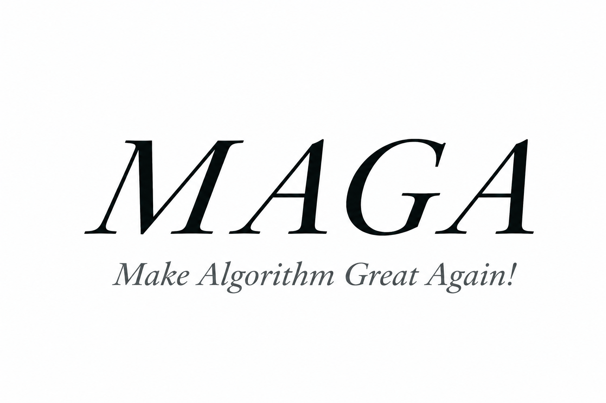
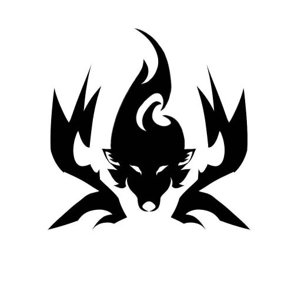

[TOC]

# 喵喵喵

 > 写在之前

  - 谢谢您看到这里。这代表您有意向了解或加入我们RC算法组。长期以来，我们一直致力于寻找志同道合的伙伴。如果您同样对**ROBOCON比赛**感兴趣，并且拥有相关的经验，欢迎您积极尝试加入我们！  
  
  - 我们本次招新主要面向**全校2025级**的同学，为正式成员考核。或者您是大二年级的同学，有相关经验，能够完成题目任务，并且在明年的比赛周期内能够在黄家湖校区正常备赛，也欢迎您的参与。  
   
   本次主要会有两道题目，一道关于视觉，一道关于导航。详细题目及要求见文件内md文件  

   **Git**以及**Docker**是本次考核提交所需用到的工具。确保您能够正确使用。

   题目提交的周期为**即日起**至**2025年6月30日晚23:59**。建议您合理安排好时间，确保在规定时间内完成题目任务。 

   虽说截止日期定的较长，但是您如果能够提前完成题目任务，会有印象分加成哦 **/ ❛˓◞˂̵✧ /** (期待..)

   如果很不幸的您没能完成规定的所有任务，只完成了部分，也可以将您的努力按照要求提交。我们会通过您作出的努力评估您是否拥有成长的能力，并有可能通知您参加后续的**面试**。

   有任何除题目详细细节或有其他问题需要咨询或者了解，请联系<mark>2148563051(QQ)</mark>
   
  

  

